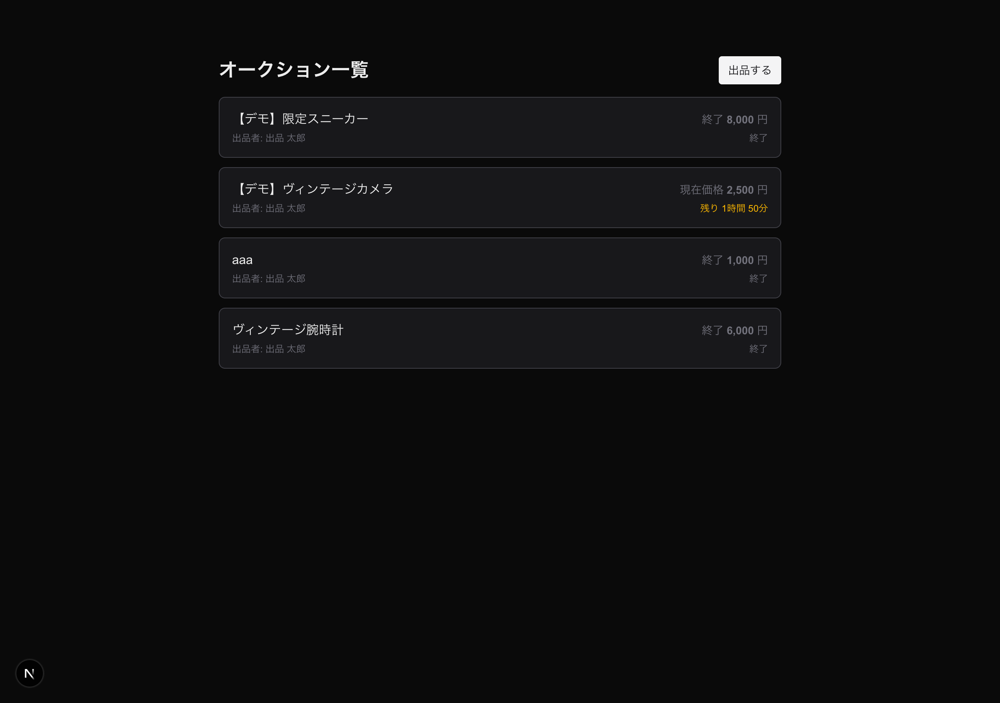
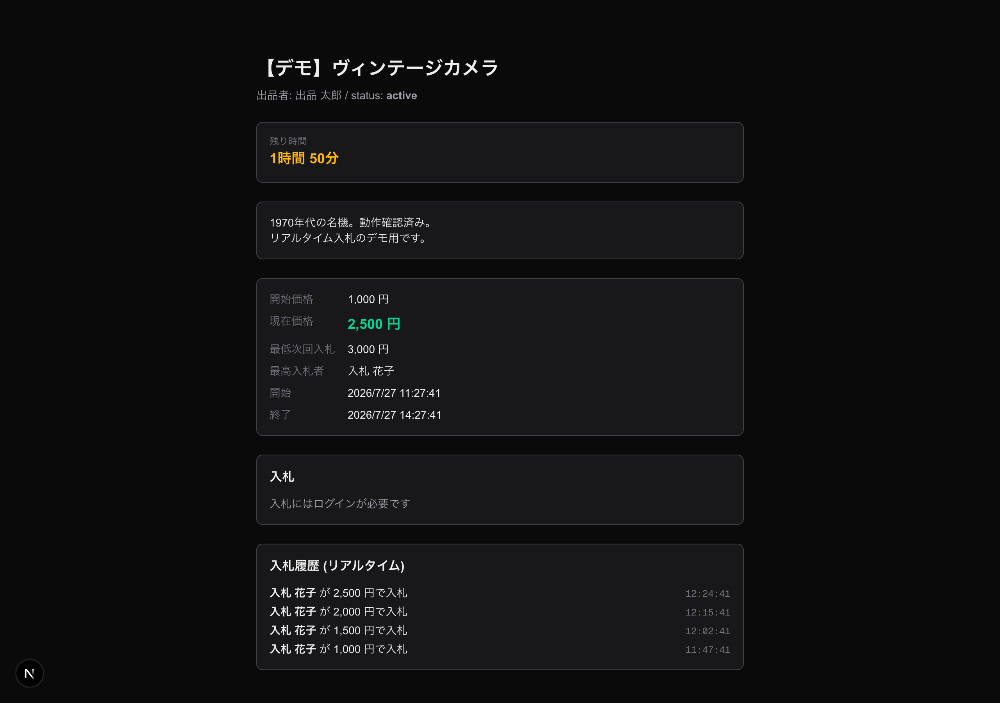
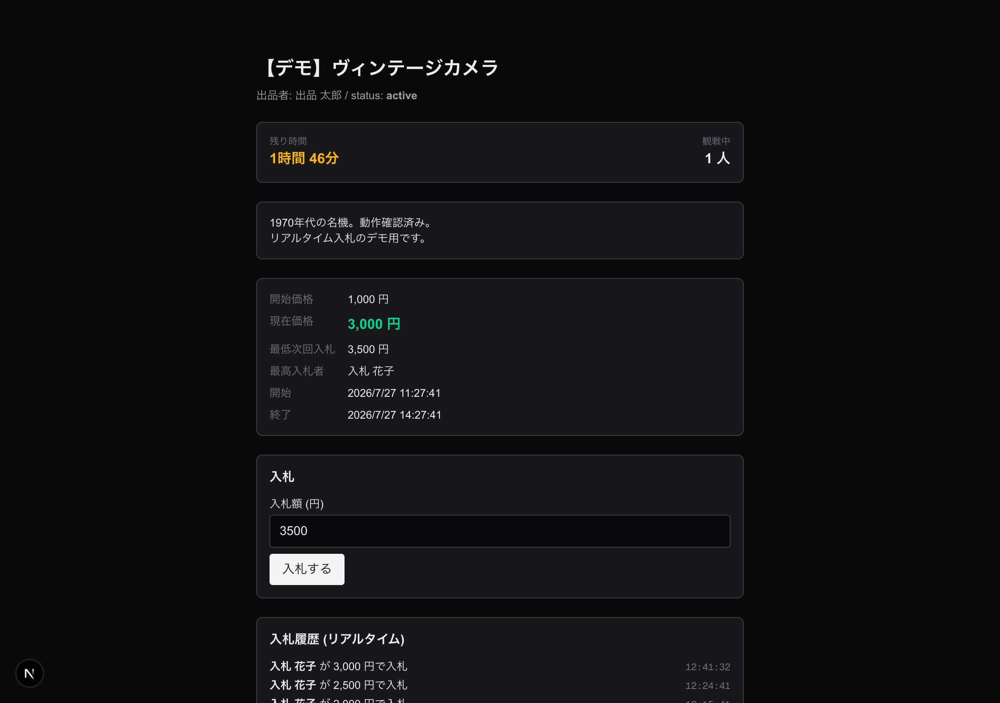
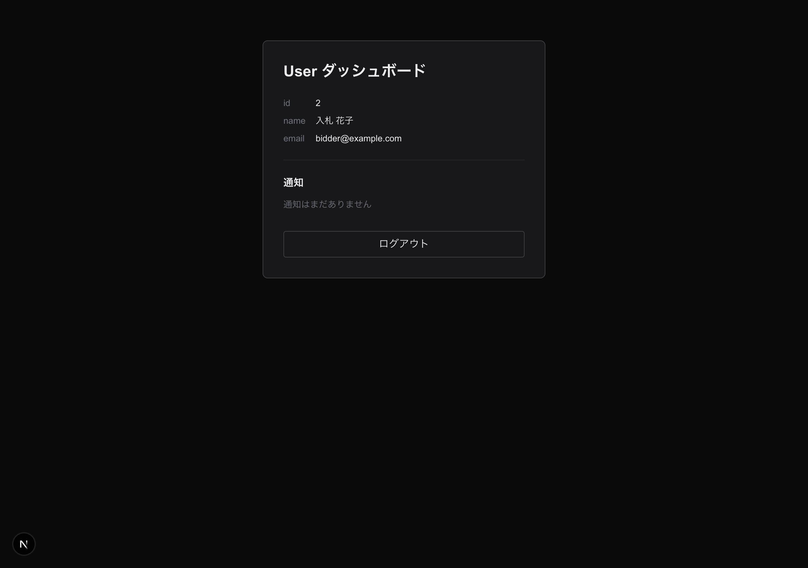
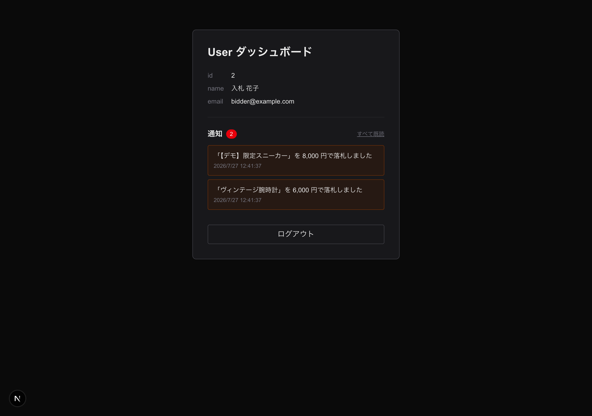

# オークション機能のブラッシュアップ 動作確認

既存のオークション機能に以下 4 点を追加し、実用性とリアルタイム性を強化した。

1. **入札履歴 API + 履歴の永続表示** — `GET /api/auctions/{id}/bids` を追加。詳細ページでリロードしても過去の入札が残る。
2. **落札確定 & 通知** — `auctions:close`（毎分スケジュール）で終了オークションを確定し、出品者・落札者へ通知（DB + Reverb ブロードキャスト、`user.{id}` private チャンネル）。
3. **残り時間カウントダウン** — 一覧・詳細で「残り ◯時間◯分」を 1 秒ごとに更新。終了時に UI を自動で終了扱いに切替。
4. **Presence 観戦人数** — `auction-presence.{id}` Presence チャンネルで「観戦中 N 人」を表示（認証済みユーザーのみ計上）。

あわせて、SPA から認証付きチャンネル（Private / Presence）を購読するための経路を整備した（これまでフロントは public チャンネルのみ使用）。

- `config/cors.php` の許可パスに `broadcasting/auth` を追加
- `frontend/lib/echo.ts` に、既存 axios（`withCredentials` + XSRF）で `/broadcasting/auth` を叩く独自 authorizer を追加（pusher-js 既定 XHR は Cookie を送らないため）

## 動作確認環境

- バックエンド: Laravel Sail（`laravel.test` / `mysql` / `redis`）、`php artisan reverb:start`（:8080）
- フロント: Next.js dev サーバ
- デモデータ: 出品者 `seller@example.com` / 入札者 `bidder@example.com`（ともに password: `password`）、アクティブなオークション（現在価格 2,500 円・入札履歴 4 件）と終了済みオークション（落札者あり・未確定）
- ブラウザ操作は puppeteer-core + system Chrome でスクリプト化して撮影

> 注: 撮影時は Docker が host:3000 を占有していたため、フロントを :3001 で起動し、検証中のみ CORS/Sanctum の許可ドメインへ :3001 を一時追加した（検証後に元へ戻した）。アプリのコード変更には含まれない。

## スクリーンショット

### 1. 一覧：残り時間カウントダウン（項目3）

アクティブなオークションは「残り 1時間 56分」、終了済みは「終了」と表示される。

### 2. 詳細（未ログイン）：入札履歴の永続表示 + カウントダウン（項目1・3）

`GET /auctions/{id}/bids` により、ページを開いた直後から過去の入札 4 件（金額・入札者・時刻）が新しい順で表示される。残り時間、`最低次回入札`、未ログイン時の「入札にはログインが必要です」も確認。

### 3. 詳細（ログイン後）：観戦人数 + 入札フォーム（項目4）

ログインすると「観戦中 1 人」が表示される（未ログインの 2. では非表示 = 認証済みのみ計上）。入札フォームは `min_next_bid`（3,000 円）で初期化。

### 4. 詳細：入札のリアルタイム反映（項目1）

`入札する` 押下後、`BidPlaced` ブロードキャストを自身の Echo リスナーが受信し、現在価格が 2,500 → **3,000 円** に更新、`最低次回入札` が 3,500 円へ、入札履歴の先頭に `12:41:32` の新規入札が追記される。

### 5. /me：落札確定前

落札確定前は通知なし。

### 6. /me：落札通知のリアルタイム受信（項目2）

`/me` を開いたまま `php artisan auctions:close` を実行すると、`user.{id}` private チャンネル経由でブロードキャスト通知がリアルタイムに届き、未読バッジ（2）と落札メッセージ「「…」を N 円で落札しました」が表示される。DB（database チャンネル）にも保存され、再訪時も一覧に残る。

## 自動テスト

`./vendor/bin/sail composer test` → **68 tests / 168 assertions OK**、`./vendor/bin/sail composer build`（csf / cs / sa / md）→ **すべて green**。

追加テスト:

- `tests/Feature/Api/BidTest.php` — 入札履歴 index（新しい順・オークション単位のスコープ）
- `tests/Feature/Api/NotificationTest.php` — 通知一覧 + 未読件数 / 全既読 / 認証要求
- `tests/Feature/Console/CloseEndedAuctionsTest.php` — 落札確定・通知・冪等性
- `tests/Unit/Notifications/AuctionSettledTest.php` — 落札者 / 出品者（落札あり・なし）の文面
- `tests/Unit/Models/AuctionTest.php` — `isSettled` / `hasWinner`
- `tests/Feature/Broadcasting/ChannelAuthTest.php` — Presence チャンネル認可
