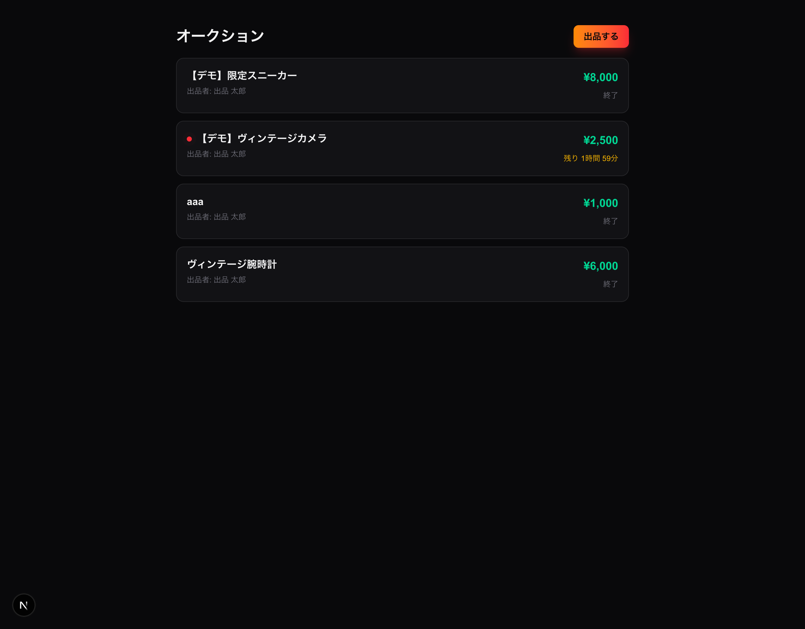
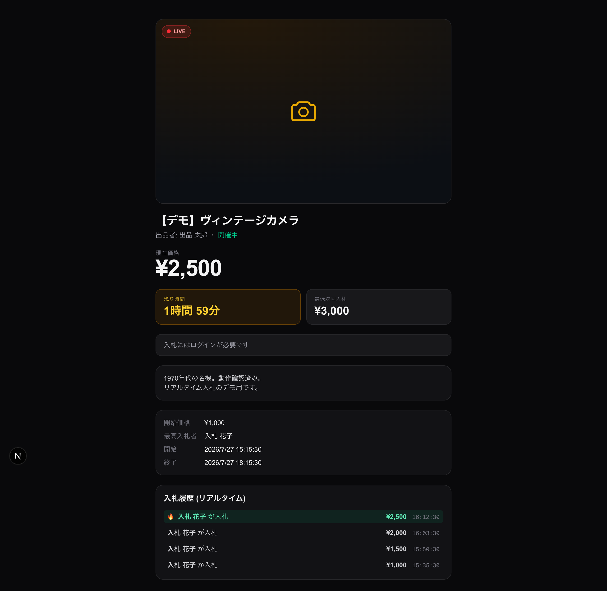
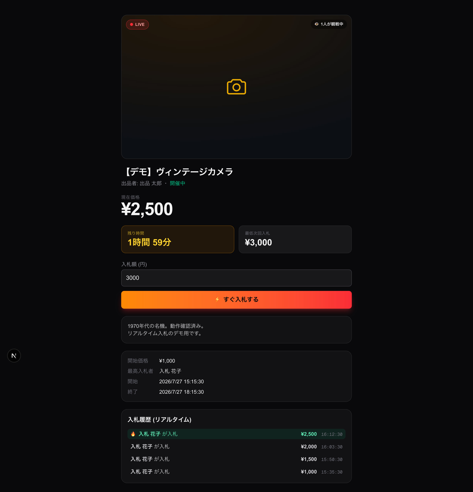
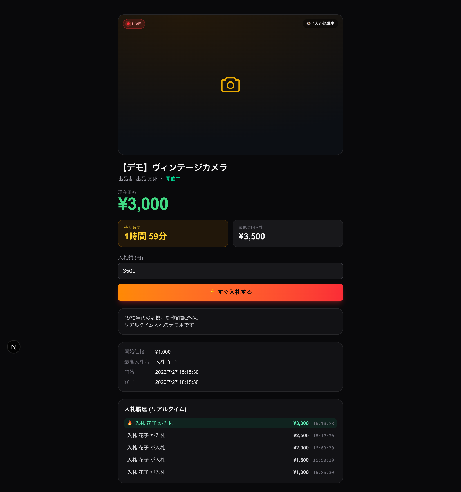
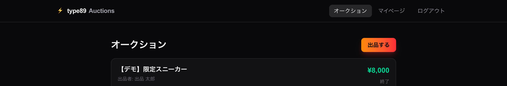
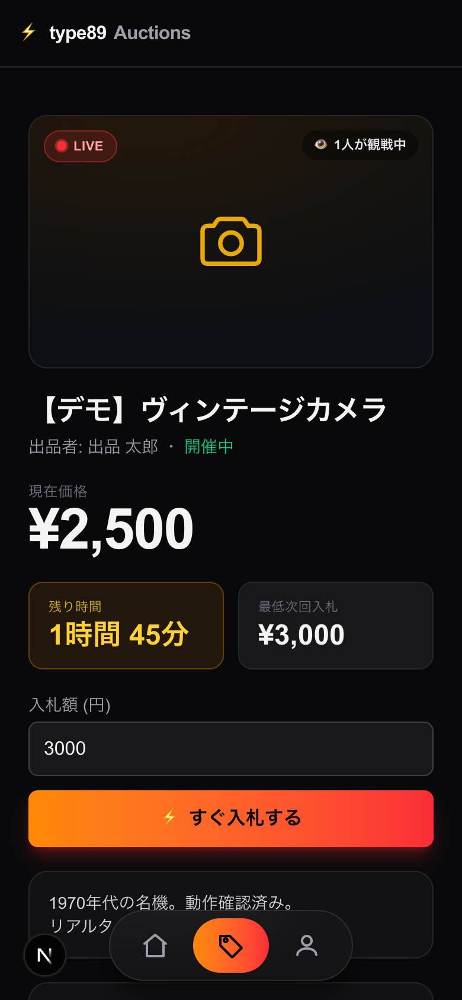

# オークションUI リデザイン（案2: ライブ感&FOMO型）動作確認

UI 調査（信頼シグナル / リアルタイム緊張感 / 大胆なタイポ / アクセントカラー）を踏まえ、3案の比較から選ばれた **案2「ライブ感&FOMO型」** を実際のオークション画面に適用した。

## デザイン方針

- **ダークな「アリーナ」**として一覧・詳細をダーク固定（OSテーマに関わらず没入感を優先）
- **LIVE バッジ + 赤の pulse**（開催中のみ）と **観戦人数**でライブ感を演出
- **特大の価格**（`¥` + tabular-nums）を主役に。価格更新時は一瞬グリーンに**フラッシュ**
- **アンバーのカウントダウン**を目立たせ、緊張感を作る
- CTA は **オレンジ→レッドのグラデーション + グロー**（`⚡ すぐ入札する`）
- 入札履歴は**最高入札を 🔥 でハイライト**
- 演出はすべて実データ駆動（偽のカウントダウン・水増し人数は使わない）。`prefers-reduced-motion` でアニメーション無効化に対応

## 変更ファイル

- `frontend/app/globals.css` — `live-pulse` / `price-flash` の keyframes
- `frontend/app/auctions/[id]/page.tsx` — 詳細ページ（ロジックは維持し見た目のみ刷新 + 価格フラッシュ）
- `frontend/app/auctions/page.tsx` — 一覧ページ

## スクリーンショット

### 1. 一覧（ダーク・LIVEドット・価格強調）

開催中の「ヴィンテージカメラ」に赤の LIVE ドットと「残り 1時間59分」、価格はグリーンで強調。終了分は「終了」。

### 2. 詳細（未ログイン）

商品ビジュアル枠（画像未対応のためカメラのプレースホルダ）、特大価格、アンバーのカウントダウン、入札履歴の永続表示。

### 3. 詳細（ログイン後）

LIVE バッジ + pulse、「1人が観戦中」、`⚡ すぐ入札する` のグラデCTA、入札フォーム。

### 4. 入札直後（価格フラッシュ）

入札で現在価格が 2,500 → **3,000 円** に更新され、価格が**グリーンにフラッシュ**（撮影はフラッシュ中）。最低次回入札は 3,500 円、履歴先頭に 🔥 で新着がハイライト。

## グローバルナビ（ページ間遷移 / モバイル対応）

各ページが独立していて遷移手段が無かったため、全ページ共通ナビを追加。モバイルは 2026 年らしい**フローティング・ガラスピル**（画面下部に浮くガラス質バー、アクティブ表示がモーフ移動）を採用した。

- **デスクトップ**: 上部ヘッダー（ブランド + オークション / マイページ / ログアウト）
- **モバイル**: 下部中央に浮く**ガラスピル**（ホーム / オークション / マイページ、アイコンのみ）。iOS セーフエリア対応
- **出品はナビに常設しない**（好みに合わせ撤去）。出品導線は一覧ページの「出品する」ボタンに集約
- 認証状態でメニューを出し分け（未ログインは「ログイン」）。`/admin` 配下では非表示

### 5. デスクトップ上部ヘッダー

### 6. モバイル フローティング・ガラスピル

## 品質確認

`npx tsc --noEmit` / `npm run lint` / `npm run build` いずれも green。既存のバックエンド・ロジックには変更なし（表示のみの刷新）。

## 補足（今後の伸びしろ）

- 3案共通の推奨だった **商品画像ギャラリー**は、モデルに画像フィールドが無いため今回はプレースホルダ。画像アップロード対応は別 PR 向き。
- `/me`・ログイン・出品フォームは従来のテーマ対応のまま（オークション「アリーナ」画面のみダーク固定）。統一したい場合は追って対応可能。
