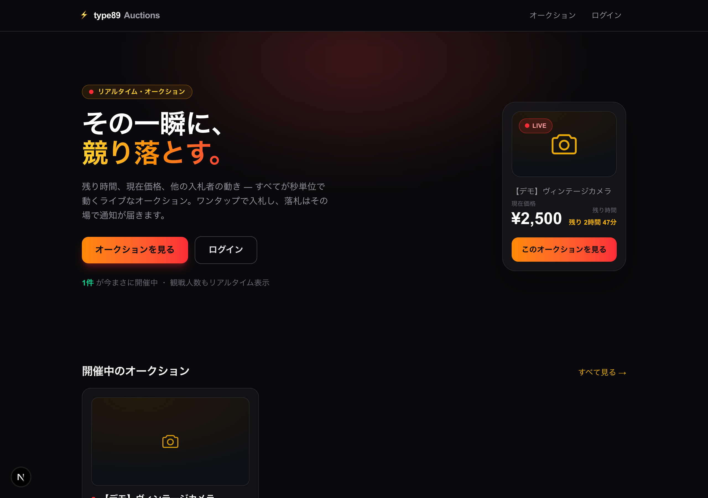
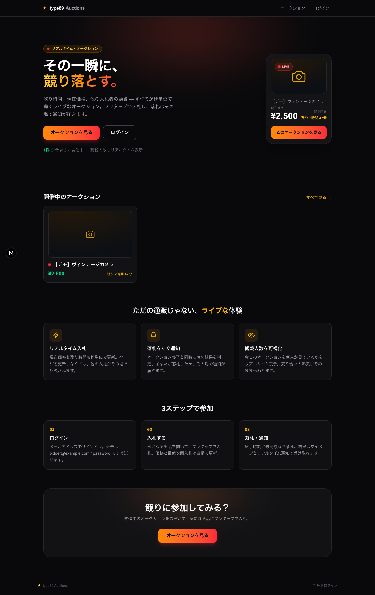
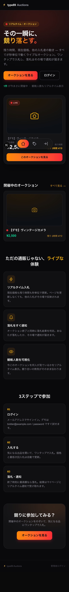

# TOP ページ（ランディング）新規作成 動作確認

開発用のヘルスチェック画面だった `/` を、ユーザーが「使ってみたい」と思えるランディングページに刷新した。既存のオークション画面（ライブ感&FOMO テイスト）と世界観を統一している。

## 参考にしたデザイン指針（Web リサーチ）

- **5秒で伝える**：大きな見出し + 短い説明 + **CTA は1つ**に絞り、視線を CTA に導く
- 静止画より**「動いている実物」を見せる**（オークションはライブなロットカード）
- **社会的証明を CTA の近くに**（開催中件数などでコンバージョン +15〜30%）
- クリアな階層・余白・単一のコンバージョン目標

## 構成

1. **ヒーロー** — 「その一瞬に、競り落とす。」の大見出し + 短い価値訴求 + 主 CTA「オークションを見る」。右側に**実データのライブ・プレビューカード**（LIVE バッジ・現在価格・残り時間・詳細への CTA）。CTA 直下に「◯件が今まさに開催中」の社会的証明
2. **開催中のオークション** — API から取得した active な出品をカード表示（hover で浮き上がる）
3. **特徴** — リアルタイム入札 / 落札をすぐ通知 / 観戦人数を可視化
4. **3ステップで参加** — ログイン → 入札 → 落札・通知
5. **締めの CTA** + フッター（管理者ログイン導線）

いずれも既存の `AuctionCountdown` を再利用し、ダーク × アンバー/オレンジ→レッドのアクセントで統一。エントランスは控えめな fade-up、`prefers-reduced-motion` 対応。

## スクリーンショット

### デスクトップ（ヒーロー）

### デスクトップ（全体）

### モバイル（全体）

## 品質確認

`npx tsc --noEmit` / `npm run lint` / `npm run build` いずれも green。ライブカードと開催中一覧は実 API（`/api/auctions`）から取得しており、上のスクショは実際の稼働環境（アクティブな「【デモ】ヴィンテージカメラ」）を撮影したもの。

## Sources（デザイン参考）

- [ContentMation: Hero Section Design Guide (2026)](https://contentmation.com/conversion/hero-section-design-guide)
- [NeelNetworks: High-Converting Landing Page Design 2026](https://www.neelnetworks.com/blog/high-converting-landing-page-design-2026/)
- [Landy AI: Landing Page Hero Section Best Practices (2026)](https://www.landy-ai.com/blog/landing-page-hero-section)
